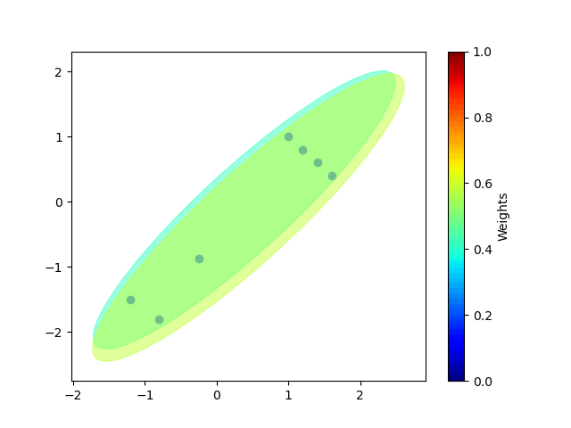
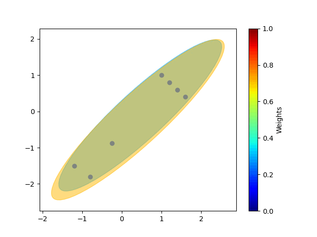
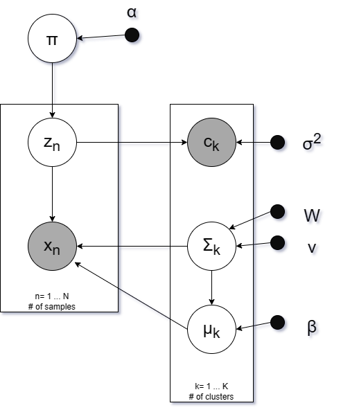

# Constrained Variational Inference GMMs
A constrained implementation of variational inference for gaussian mixture models.

Constraint is provided as an extra observation showing how many points belong to each cluster.

## Example
### Unconstrained

### Constrained, ratios = $[\frac{5}{7},\frac{2}{7}]$

## Mathematical Derivation
The variational inference GMM is based on the derivation from Lecture 24 from the probabilistic machine learning course at Tübingen [link](https://uni-tuebingen.de/en/180804).

### Constrained GMM

In addition to the distribution from the previously mentioned source. There is an additional $P(C|Z)$ assumed to follow this distribution:
$$P(c_k|Z) = N(c_k; \sum_{n=1}^{N}Z_{nk}, \sigma^2)$$

With all the $c_k$ independent. This constrains the observed ratios for clusters in Z, but allows the model to probabilistically select which point is in each cluster (instead of imposing hard cluster sizes for each cluster).

Note: This only modifies q(z) for the variational inference; however, it couples all values together, so a sample estimate using a Gibbs Sampler is used to estimate $\mathbb{E}_{q(z)}[Z]$. The gibbs sampler randomly changes one row from Z and is expected to reach samples from the stationary distribution matching q(z).